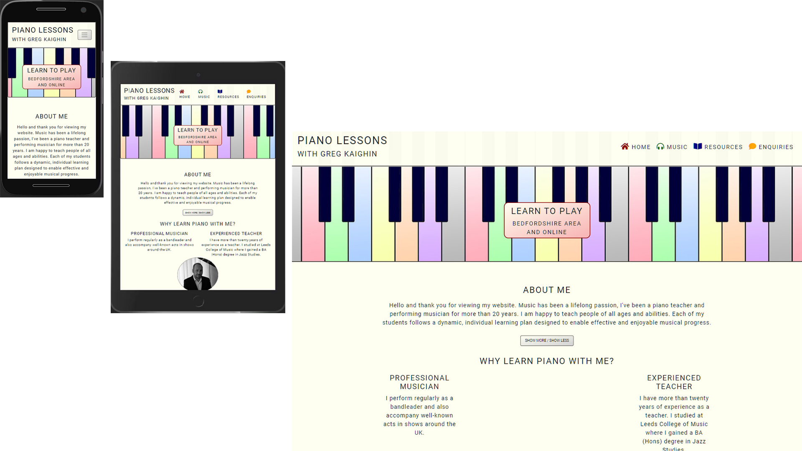
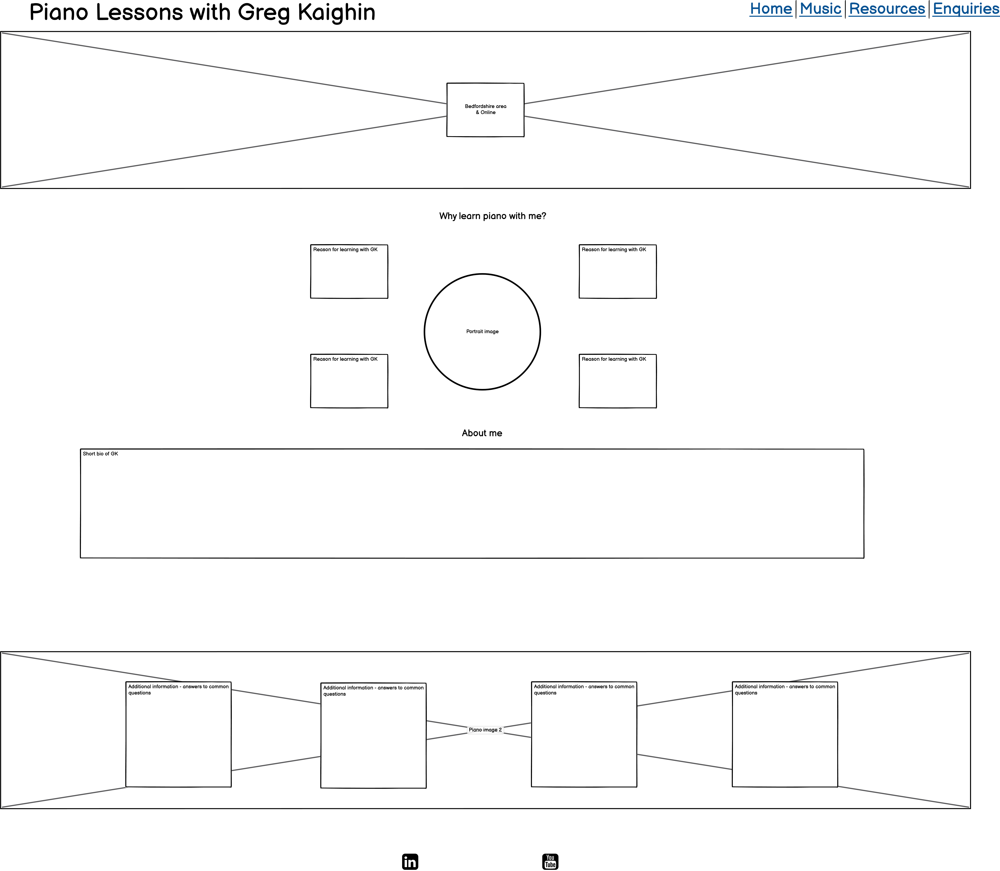
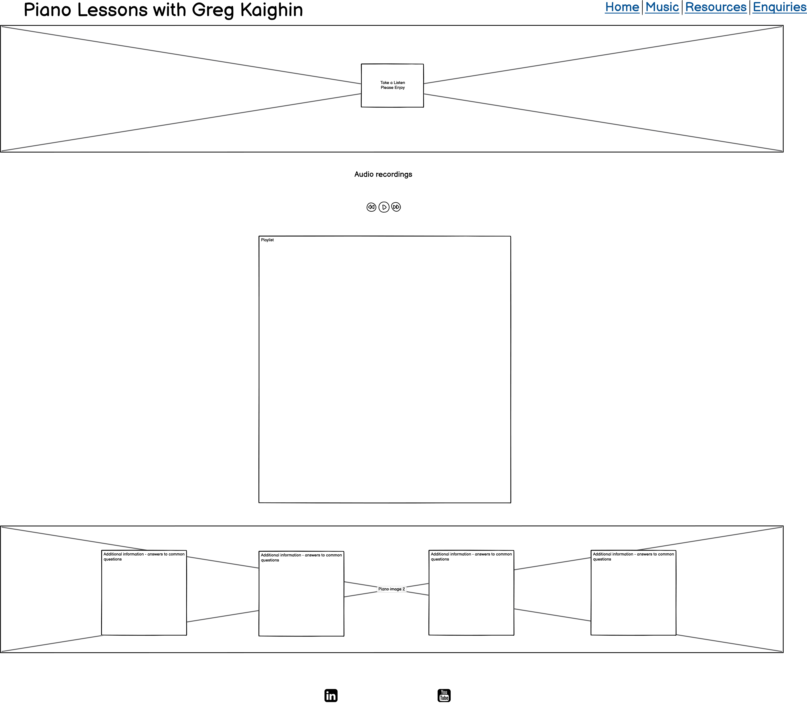
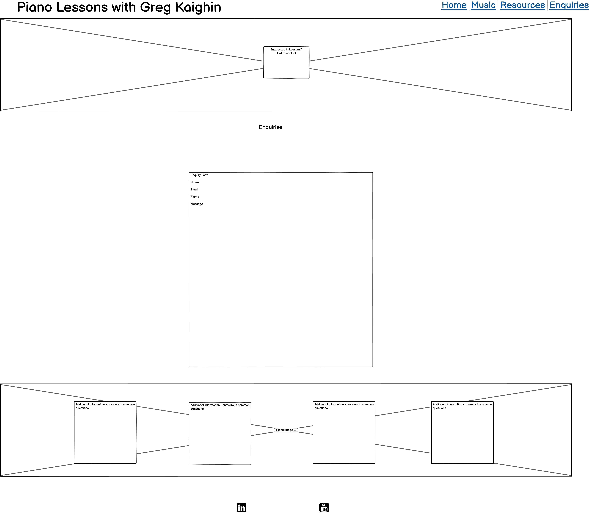

# Piano Lessons with Greg Kaighin

## Greg Kaighin

## Code Institute - Full Stack Developer HND

### Milestone Project 1

### User-Centric Front-End

### February 2021

  

  

The website is built for my own established self-employed piano-teaching business "Piano Lessons with Greg Kaighin", to advertise the business to prospective students and to provide them with a means of getting in contact. It is also created to be of value to current students by providing links to downloads of teaching resources and to relevant external websites.

## Table of Contents

1.  [UX](#ux)

-  [Goals](#goals)

-  [Visitor Goals](#visitor-goals)

-  [Business Goals](#business-goals)

-  [User Stories](#user-stories)

-  [Design Choices](#design-choices)

-  [Wireframes](#wireframes)
- 
# UX
The website is for people who may be considering taking piano lessons with GK, to provide them with the information they need to decide whether or not to take piano lessons with GK. It is also for existing students, to provide teaching resources in PDF file format and links to relevant external websites such as music exam boards.

## Visitor Goals
- find a piano teacher.
- find out information about the business.
- listen to some music.
- download piano lesson resources.
- make an enquiry about piano lessons.
## Business Goals
- advertise the business to potential customers and to provide them with a means of getting in contact.
- raise awareness of the business among the general public, both online and locally.
- collect contact and other relevant information from prospective customers via a form.
## User Stories
As a visitor to Piano Lessons with Greg Kaighin I expect/want/need:
1. To be able to navigate the website easily and to quickly find the information I am looking for.
2. To get relevant information about GK the piano teacher.
3. To get information to help me decide if GK is the right piano teacher for me.
4. For all information to be presented clearly and logically.
5. To be able to make contact easily if I decide I want to.
6. To be able to download sheet music for my piano lessons.
7. To get information about music exams.
8. To be able to access the website on my phone, tablet and computer.
9. To listen to some piano music.
10. For the website to have a coherent look.
11. For everything to work.
 
These user stories were used to inform the design of the site. I decided that the website structure would consist of four pages to fulfil specific needs, as follows.
### Home page
About Me, Ethos, Testimonial
### Music page
Audio Player
### Resources page
Table of PDF resources and links to external websites
### Enquiries page
A contact form

# Wireframes
These wireframes were created to outline the basic structure of the site.

A prototype version of this website can be found here https://github.com/GregKaighin/piano-lessons-with-greg-kaighin-1.0-msp1-code-institute.

I was initially going to develop this version further for my project, but after deciding that I would use Bootstrap for a more

responsive layout, I started a new build in a new repository. Also, I realised that my earlier commit messages were not frequent

or complete enough. Now that I have become more accustomed to using GitHub, I avoid making commits that contain a large number of

changes, and try to keep commit messages concise.

  

  

It is built with a mobile-first design, but it is also responsive enough to look acceptable on large displays, particularly the resources page, where, based on user-stories, a user is considered to be more likely to access the site using a laptop or desktop computer. It is built to be compatable with the vast majority of modern smartphones, tablets and personal computers.

  

The enquiries form is not yet functional.

  

All other parts of the website are working as intended.

  

# Technologies Used:

  

- HTML5

- CSS3

- Font Awesome

- Bootstrap 4.1.3

- js popper

- JavaScript (for audio player and track info popovers only)

- Adobe Photoshop

  

# Testing

The website has been tested using a number of different manual and automatic methods listed below:

  

### Validation:

- HTML - (https://validator.w3.org/) -

- CSS - (https://jigsaw.w3.org/css-validator/) - No Errors Found / ## Warnings

- JavaScript

  

### Original Content:

MP3 Audio recordings: Greg Kaighin

PDF Documents: Greg Kaighin

All sheet music and music recordings are free of copyright restrictions.

Colours: Gradient fills on piano keys image generated with Photoshop. The colour scheme was chosen to give an ‘educational’ aesthetic to the website, and features pastel-coloured gradients surrounded by solid 2-pixel borders.

  

### Target Audience

  

- Internet users who might be considering taking piano lessons.

- Current piano students

  

# Features

  

### Primary

  

- Navbar. Bootstrap's navbar-light and fixed-top class are used to create an intuitive navbar which is always

present at the top of the viewport. Each page link is named (Home, Music, Resources, Enquiries), and also

given a primary coloured font-awesome icon, to provide users with a further visual cue.

  

- Hero Image. The image used in the page header is of a coloured piano keyboard. This was chosen as it is visually

striking, and it sets the tone for the rest of the website's visual design.

  

- About-Me Section. The purpose of this section is to give information about GK. This is the first section to appear

after the header as, based on user stories, it is most likely the first thing that prospective piano students will want

to read. As there is a lot of text, some of it is hidden behind a 'Show More / Show Less' button. This is not ideal,

it could be improved by revealing the hidden text with an upwards scroll, rather than a downwards one, a fix for

the future.

  

- Ethos Section. This section is designed to relay the ethos of 'Piano Lessons with GK'. It is displayed directly

below the 'About-Me', and is designed to complement the information found there. The layout of this section was inspired

by the ethos section of the 'Love Running' website on the Code Institute's FSD course.

  

- Testimonial Section. This section is for displaying comments from existing piano students. For data-protection

purposes, adult names are used with permission. Comments from children are displayed with an alias.

  

- Social Links. These are displayed at the top of the footer, as a Bootstrap button, displayed as a font-awesome

icon, in their original brand colours, in order to stand out a little from the rest of the content on the page.

  

- Cards Section. Bootstrap cards are displayed at the bottom of the footer, containing information about pricing,

and also information about additional subjects available from 'Piano Lessons with GK' such as workshops, and music

technology, and music theory lessons.

  

- Audio Player. This was adapted from (https://codepen.io/vanderzak/pen/BayjVep). I have included the HTML and JavaScript

largely unchanged from the original, but have stripped out the parts relating to the progress bar, as I don't require

the player to have that functionality. The CSS styling of the audio player I have done myself. It's purpose is to give

a simple juke-box style audio player with a set playlist.

  

- Resources Section. This section uses Bootstrap's table class to provide a table of links of PDF downloads, and links

to external websites relevant to piano lessons.

  

- Enquiries Form. A Boostrap's form class is used to create a simple enquiry form with a modal popup to say thank

you once it has been submitted. The form is not yet functional, this will be rectified once I have learned how to

do it.

  

### Secondary

  

- Audio playback of music files.

- Download of sheet music PDFs.

- Links to external websites.

  

# Roadmap features

  

- Signup and payments page for group music workshops.

  

- Automatic student waiting list, which can be easily activated/deactivated as required and which lets potential customers know how many people are already on the list.

  

- The header message will be updated as required to reflect current business circumstances.

  

# Known issues and potential solutions

- Issue: navbar dropdown menu always appears on the left side. It would sometimes look better positioned on the right.

Potential solution: Change index.html navbar-toggler class IDs.

  

- Issue: Audio player progress bar does not behave as expected.

Potential solution: JavaScript fix.

  

- Issue: Show more / Show less button on index.html page collapses downwards. An upwards collapse (expand?) would provide better UX and

flow.

Potential solution: jspopper? I need to learn how to do this.

  

- Issue: Make the "About Me" section have the same opacity as the navbar. This will improve the overall look of the hero image

and "open it up" a little.

Potential solution: JavaScript? I need to learn how to do this.

  

# Design Choices

  

The visual style came together quite late in the project after several unsuccessful attempts at using images of paintings as a "hero" type image. I felt that they looked fine on a laptop, however they didn't scale down to small viewports very well, and also seemed to dominate the look of the website too much.

  

These were replaced with a simpler image of a piano keyboard outline, to which colour-gradient fills have been applied to the piano keys. This image was chosen because it is visually striking, and together with the logo next to it, instanly relays the subject matter of the website to the user upon opening a page.

- The background colour is ivory #fffff0, of course, and the dark colour of the text is chosen to match the black keys on a piano #221d17.

  

- The "black" keys in the main jumbotron image have been coloured dark blue, as they looked too dark on screen when completely black.

  

- The font is Roboto, from Google fonts. I chose this because it is very clear and easy to read.

  

- The links to other webpages on the resources page are dark blue, as are the PDF file download links.

  

- The internal links in the about me section are coloured BGY to match the navigation icons.

  

- The social link button icons are displayed in their original brand colours to stand out.

  

- For page navigation, a simple RGBY colour is given to the navigation icons. The order of the colours here matches the order of the colours on the piano keyboard image.

  

- The buttons are silver-grey, to make them noticeable but not intrusive, flashing pink when pressed to provide feedback to the user.

  

- The overlay shapes displayed over the piano keyboard image on each page matches the RGBY theme of the corresponding navigation icons, and this theme is extended through some of the elements throughout.

  

- The audio player on the Music page has a simple UI, with intuitive controls. Green borders are applied to the buttons to tie the player into the colour scheme used in the navbar icons.

  

- The Resources section information is presented using Bootstrap's .table-striped and .table-light classes.

  

- Bootstrap layout classes are applied to the elements in order to achieve page designs that are responsive.

  

- Overall, I am happy with the design and layout at small and medium screen sizes, and I think it looks best at these sizes.

  

- I am not completely happy with the layout at large screen sizes as I feel there is too much white space visible on-screen. In future I may add in more elements that appear at the screen edges on large screens.

  

# Credits

  

- Thanks to Oluwafemi Medale for all of the expert advice he gave during my mentoring sessions with him, and to all the tutors who put together such an engaging and interesting course.

- Hero image: Shutterstock

- Card Images: Pexels