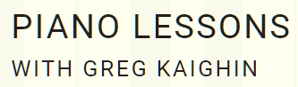
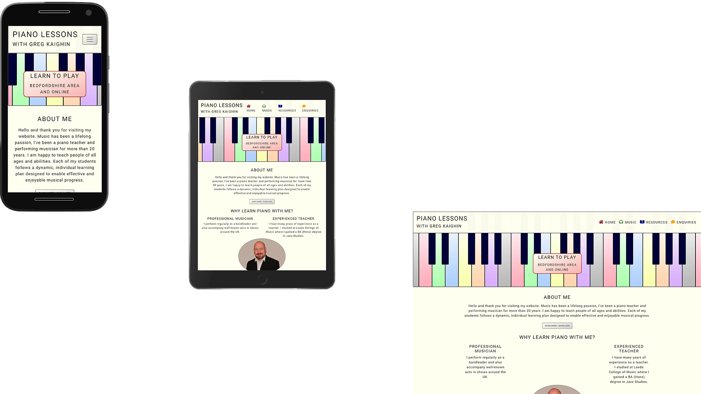

# Piano Lessons with Greg Kaighin

## [Greg Kaighin](https://github.com/GregKaighin)
## [Code Institute](https://codeinstitute.net/)
## Full Stack Developer HND
## Milestone Project 1
## User-Centric Front-End
## February 2021
https://gregkaighin.github.io/piano-lessons-with-greg-kaighin-website/

This website is made for my own established self-employed piano-teaching business 'Piano Lessons with Greg Kaighin' to advertise the business to prospective students and to provide them with a means of getting in contact. It is also created to be of value to my current students by providing links to downloads of learning resources and to relevant external websites.

## Table of Contents
1. [UX](#ux)
    -  [Visitor Goals](#visitor-goals)
    -  [Business Goals](#business-goals)
    -  [User Stories](#user-stories)
    -  [Design Choices](#design-choices)
    -  [Wireframes And Prototype Build](#wireframes-and-prototype-build)
2. [Features](#features)
    - [Existing Features](#existing-features)
    - [Elements On Every Page](#elements-on-every-page)
    - [Elements Unique To Each Page](#elements-unique-to-each-page)
    - [Home Page](#home-page)
    - [Music Page](#music-page)
    - [Resources Page](#resources-page)
    - [Enquiries Page](#enquiries-page)
    - [Features For Future Releases](#features-for-future-releases)
3. [Technologies Used](#technologies-used)
    - [Languages](#languages)
    - [Libraries](#libraries)
    - [Tools](#tools)
4. [Testing](#testing)
    - [Validation](#validation)
    - [Performance](#performance)
5. [Deployment](#deployment)
6. [Credits](#credits)
    - [Images](#images)
    - [Original Content](#original-content)
    - [Acknowledgements](#acknowledgements)
8. [Contact](#contact)

# UX

The target audience is internet users who might be considering taking piano lessons for themselves or someone they know, and also current students.\
The enquiries form is not yet functional. All other parts of the website are working as intended.

## Visitor Goals
- Find a piano teacher.
- Find out information about the business.
- Download piano lesson resources.
- Make an enquiry about piano lessons.
- Listen to some piano music to evaluate GK's musical skill level. 

## Business Goals
- Advertise the business to potential customers and provide them with a means of getting in contact.
- Raise awareness of the business among the general public, both online and locally.
- Collect contact and other relevant information from prospective customers via a form.

Piano Lessons with Greg Kaighin meets these needs because:
- Relevant information is displayed clearly and is easily navigable.
- The design of the site is based on user-stories and my experience as piano teacher.

## User Stories

As a visitor to Piano Lessons with Greg Kaighin I expect/want/need:
1. To be able to navigate the website easily and to quickly find the information I am looking for.
2. To get relevant information about GK the piano teacher.
3. To get information to help me decide if GK is the right piano teacher for me.
4. For all information to be presented clearly and logically.
5. To make contact easily if I decide I want to.
6. To download sheet music for my piano lessons.
7. To get information about music exams.
8. To access the website on my phone, tablet and computer.
9. To listen to some piano music.
10. For the website to have a coherent look.
11. For everything to work.

# Design Choices

- The Roboto font, from [Google Fonts](https://fonts.google.com/) is used throughout the website. I chose this because it is very clear and easy to read, and it's bold lines fit in well with the rest of the page design.
- The main image, displayed below the logo on each page, is a simple outline drawing of a piano-keyboard, to which pastel coloured gradient fills have been applied using [Adobe Photoshop](https://www.adobe.com/uk/products/photoshop.html). This image was chosen because it is visually striking, and together with the text logo, instantly relays the subject matter of the website to the user upon them opening a page.
- The navbar [Font-Awesome](https://fontawesome.com/) icons in the navbar-menu and also the page links in the 'about me' section text are coloured RGBY, sequentially.
- The overlay shapes displayed over the piano-keyboard image on each page match the RGBY theme of the corresponding navigation icons, and this theme is extended further onto selected elements on each page.
- The social link button icons are displayed in their original brand colours to stand out.
- The menu-toggle, 'show-more/show-less' and 'send' buttons are silver-grey, to make them noticeable but not intrusive, flashing pink when pressed to provide feedback to the user.
- The audio player on the music page has a simple UI, with intuitive controls. Green highlights are applied to tie the player in to the colour scheme used for the navbar icons.
- Information in the on the resources page is presented using Bootstraps .table-striped and .table-light classes.
- The links to other webpages on the resources page are dark blue, as are the PDF file download links.
- Elements which have square corners by default have been rounded to slighty soften the overall look.
- [Bootstrap](https://getbootstrap.com/) is used throughout, both for the convenience of it's prebuilt components which can be readily modified to suit, and for it's relativley straightforward grid system.

I am most happy with the design and layout at small and medium screen sizes. In future I will consider adding in more elements that appear near the viewport edges on large screen sizes, to fill some of the empty space.

## Colours
The idea is to give the site an 'educational' look, somewhat akin in style to that of a school textbook.
To obtain a coherent look I have used structure when choosing colours. There are three distinct pallettes, as follows:
1. The background colour is ivory #fffff0, chosen because it is the classic colour of white piano keys. Similarly, the colour of the text and borders, black #221d17 was chosen because it closely matches the colour of the black keys on a piano.
2. The four menu navigation icons are assigned primary colours RGBY. The order of these matches the order of the first four colours on the piano-keyboard image.
3. On the main piano image in the header, the white keys are filled in a sequence of gradients with pastel shades of red, green, blue, yellow, orange, purple, silver. These colours are chosen to be softer than the navigation icon colours.
The black keys in the main piano image have been coloured dark-blue, as they looked too dark on screen when completely black.

## Styling
- Colour gradients are used on many elements to add interest to the visual design.
- Rounded edges are used on many elements to soften the overall look.
- A hint of transpareny has been added to the navbar, whilst care has been taken to ensure text is still clearly legible at all scroll positions. This makes the page look nicer, and also provides subtle feedback to the user when they scroll the page.
# Wireframes and Prototype Build

These wireframes were created to outline the basic structure of the site. The current version is fairly close to these, the main changes are to the logo text, which has been changed to spread over two lines instead of one, to fit better onto small screen sizes, and to the social links, which have been moved to be above the cards in the footer, as I thought they might not be noticed right at the bottom of the page.

[Piano Lessons with Greg Kaighin | Home](https://drive.google.com/file/d/1JsqgKQF5_L_WCHw1bg1dEbcjS0MShLmw/view?usp=sharing)

[Piano Lessons with Greg Kaighin | Music](https://drive.google.com/file/d/1blL3jhX2EMzTMdUZ2P2wOghH89ClmTWB/view?usp=sharing)

[Piano Lessons with Greg Kaighin | Resources](https://drive.google.com/file/d/1eb1m-NoGh9VAodiyHJRttJ_tbaRS8uHp/view?usp=sharing)

[Piano Lessons with Greg Kaighin | Enquiries](https://drive.google.com/file/d/1m3KIKxftatb8t8JhpfAypRh5SQ-9QoYm/view?usp=sharing)

A prototype version of the website can be found here: [github.com/GregKaighin/piano-lessons-with-greg-kaighin-v1.0-msp1-code-institute](https://github.com/GregKaighin/piano-lessons-with-greg-kaighin-v1.0-msp1-code-institute). I was initially going to develop this version further for my project, but after deciding that I would use Bootstrap for a more responsive layout, I started a new build in a new repository. Also, I realised that my Github commit messages in this previous build were not frequent or concise enough. Now that I have become more accustomed to using GitHub, I avoid making commits that contain a large number of changes, and try to keep commit messages brief and concise.\
The new version of the website is built with a mobile-first design, but it is also responsive enough to look acceptable on large displays.
# Technologies Used:

## Languages
- HTML5
- CSS3
- JavaScript (imported from [codepen.io/vanderzak/pen/BayjVep](https://codepen.io/vanderzak/pen/BayjVep) for the audio player.)
## Libraries
- [Bootstrap](https://getbootstrap.com/) for it's prebuilt components and relatively straightforward sizing and layout capabilities.
- [Font-Awesome](https://fontawesome.com/) for the navbar menu items.
- [Google Fonts](https://fonts.google.com/) for the Roboto font, which is used throughout the website.
- [js popper](https://popper.js.org/) for the navbar menu-toggle button and the show more/show less button in the 'about-me'.
## Tools
- [Adobe Photoshop](https://www.adobe.com/uk/products/photoshop.html) for editing the images and encoding in .webp format.
- [Balsamiq Wireframes](https://balsamiq.com/) for creating the wireframes.
- [GitHub](https://github.com/) for storing the repository.
- [realfavicongenerator](https://realfavicongenerator.net/) for generating the favicons.
# Testing

The website has been validated and tested using the methods listed below. The results of these tests have been used to help refine the code as much as possible to my current level of knowledge.
## Validation
- HTML: [validator.w3.org](https://validator.w3.org/) - No errors or warnings to show.
- CSS: - [jigsaw.w3.org/css-validator](https://jigsaw.w3.org/css-validator/) - No Errors Found.

    

 

## Performance

[web.dev/measure/](https://web.dev/measure/)

# Features

## Existing Features
### Elements On Every page
#### Header
- Navbar. Bootstrap's navbar-light and fixed-top class are used to create an intuitive navbar which is always present at the top of the viewport. Each page link is named (Home, Music, Resources, Enquiries), and also given a primary coloured Font-Awesome icon, to provide users with a further visual cue.
- Hero Image. The image used in the page header is of a coloured piano keyboard. This was chosen because it is visually striking, and it sets the tone for the rest of the website's visual design.
#### Footer
- Social Links. These are displayed at the top of the footer, as a Bootstrap button, displayed as a font-awesome icon, in their original brand colours, in order to stand out a little from the rest of the content on the page.
- Cards Section. Bootstrap cards are displayed at the bottom of the footer, containing information about pricing, and also information about additional subjects available from 'Piano Lessons with GK' such as workshops, and music technology, and music theory lessons.

### Elements Unique To Each Page
#### Home Page
- About-Me Section. The purpose of this section is to give information about GK. This is the first section to appear after the header as, based on user stories, it is most likely the first thing that prospective piano students will want to read. As there is a lot of text, some of it is hidden behind a 'Show More / Show Less' button. This is not ideal, it could be improved by revealing the hidden text with an upwards scroll, rather than a downwards one, a fix for the future.
- Ethos Section. This section is designed to relay the ethos of 'Piano Lessons with GK'. It is displayed directly below the 'About-Me', and is designed to complement the information found there. The layout of this section was inspired by the ethos section of the 'Love Running' website on the Code Institute's FSD course.
- Testimonial Section. This section is for displaying comments from existing piano students. For data-protection purposes, adult names are used with permission. Comments from children are displayed with an alias.
#### Music Page
- Audio Player. This was adapted from code created by Zakari Abdessamad and imported from [codepen.io/vanderzak/pen/BayjVep](https://codepen.io/vanderzak/pen/BayjVep). I have included the HTML, CSS and JavaScript largely unchanged from the original, but have stripped out the parts relating to the progress bar, as I don't require the player to have that functionality. The CSS has been edited to make the audio player fit in with the visual design of the website. It's purpose is to give a simple juke-box style audio player with a set playlist.
#### Resources Page
- Resources Section. This section uses Bootstrap's table-light class to provide a table of links of PDF downloads, and links to external websites relevant to piano lessons.
#### Enquiries Page
- Enquiries Form. Bootstrap's form class is used to create a simple enquiry form with a modal popup to say thank you once it has been submitted. The form is not yet functional, this will be rectified once I have learned how to do it.

## Features for Future Releases
- Signup page with payment form for group workshops.
- Automatic student waiting list, which can be easily activated/deactivated as required and which lets potential students know how many people are already on the list.
- Update the message on the header overlay text on the home page and the enquiries page as required to reflect current business circumstances (i.e. whether I am currently taking on new students or not).
- An additional audio player on the resources page for the playback of backing track audio files.
- Expansion and redesign of the resources table when more material is added.

# Known Issues and Potential Solutions

- Issue: the enquiries form is not yet functional. Fix: I need to learn how to do this.
- Issue: The 'thank you for your enquiry' modal popup shows whenever the 'send' button is pressed, regardless of whether or not any information has been entered into the form. This will be corrected when I add in the back-end code required to make the form functional.
- Issue: navbar dropdown menu always appears on the left side. It would sometimes look better positioned on the right (on smartphones larger than iPhone 5). Potential solution: Change index.html navbar-toggler class IDs.
- Issue: Show more / Show less button on index.html page collapses downwards at present. An upwards collapse would provide better UX and flow, and also stop my portrait photo from being used as a virtual basketball. Solution: I need to learn how to do this.
- Issue: All images are currently served in .webp format. I understand that this may cause compatibilty issues with older Apple devices. Solution: Provide fallback images for devices which don't support .webp files. 
# Deployment

For the purposes of assesment the website has been deployed on GitHub pages here: [gregkaighin.github.io/piano-lessons-with-greg-kaighin-v2.0-msp1-code-institute](https://gregkaighin.github.io/piano-lessons-with-greg-kaighin-v2.0-msp1-code-institute/). Once I have learned how to make the enquiries form functional, I will deploy it again using a paid-for website hosting service, and it will become useful for my piano teaching business. 

# Credits

## Images
- Portrait photo: Sheila and Jeff Kaighin, thanks Mum and Dad.
- Piano-keyboard image and card images: [shutterstock.com](https://www.shutterstock.com/) (Paid-for licence with permission for web distribution).
## Original Content
- MP3 Audio recordings: Greg Kaighin
- PDF Documents: Greg Kaighin
- All sheet music and music recordings featured on this website were created by Greg Kaighin. Original composers have been credited.
## Acknowledgements
- Thanks to Zakari Abdessamad for sharing the audio player code used in this website at [codepen.io/vanderzak/pen/BayjVep](https://codepen.io/vanderzak/pen/BayjVep).
- Thanks to [Oluwafemi Medale](https://github.com/omedale) for the advice he gave me during my mentoring sessions, and to the [Code Institute](https://codeinstitute.net/) staff and tutors for putting together such an engaging course.

# Contact
Greg Kaighin
gregkaighin@hotmail.com