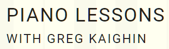
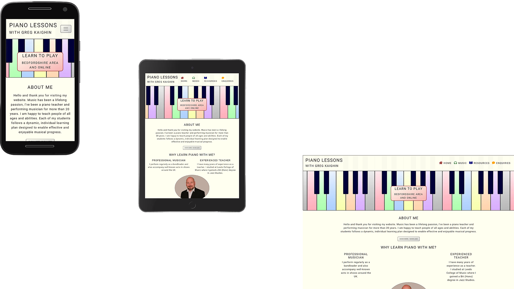

# Piano Lessons with Greg Kaighin



## [gregkaighin.github.io/piano-lessons-with-greg-kaighin-website](https://gregkaighin.github.io/piano-lessons-with-greg-kaighin-website/)



A website for the self-employed piano teaching business 'Piano Lessons with Greg Kaighin'. It advertises the business to prospective students, provides a means of getting in contact, displays live Google reviews, and offers downloadable learning resources for current students.

## Table of Contents
1. [Features](#features)
2. [Technologies Used](#technologies-used)
3. [Development Workflow](#development-workflow)
4. [Deployment](#deployment)
5. [Design](#design)
6. [Credits](#credits)
7. [Contact](#contact)

---

# Features

### Every Page
- **Navbar** — responsive Bootstrap navbar, fixed to the top, with RGBY-coloured Font Awesome icons per page link.
- **Hero image** — coloured piano keyboard, with a page-specific overlay shape and text.
- **Footer** — LinkedIn social link, pricing cards (Online, In Your Home, Workshops, Additional Subjects), back-to-top button.

### Home Page
- **About Me** — CSS-only fade and expand, toggled via a hidden checkbox and "Read more / Read less" label. No JavaScript required.
- **Ethos section** — portrait photo and four ethos points laid out responsively with Bootstrap.
- **Google Reviews** — live reviews fetched from the Google Places API (New) and rendered dynamically, with reviewer initials badge and star rating. Reviews are displayed in a randomised order on each page load.

### Music Page
- **Audio player** — jukebox-style player adapted from [codepen.io/vanderzak/pen/BayjVep](https://codepen.io/vanderzak/pen/BayjVep), with play/pause, next/previous, and mute controls.

### Resources Page
- **Sheet music downloads** — PDF downloads of scales, arpeggios and pieces.
- **Website links** — links to ABRSM, Trinity College, and London College of Music graded exam pages, and other relevant resources.

### Enquiries Page
- **Enquiries form** — functional contact form powered by [EmailJS](https://www.emailjs.com/), with a Bootstrap modal confirmation on submission.

---

# Technologies Used

### Languages
- HTML5
- CSS3
- JavaScript
- Python (build tooling only)

### Libraries and Frameworks
| Library | Version | Purpose |
|---|---|---|
| [Bootstrap](https://getbootstrap.com/) | 5.3.3 | Layout, navbar, cards, modal |
| [Font Awesome](https://fontawesome.com/) | Kit | Icons |
| [Google Fonts — Roboto](https://fonts.google.com/) | — | Typography |
| [Google Maps JavaScript API + Places API (New)](https://developers.google.com/maps) | weekly | Live Google Reviews |
| [EmailJS (@emailjs/browser)](https://www.emailjs.com/) | 4 | Enquiries form |
| [Jinja2](https://jinja.palletsprojects.com/) | ≥3.1 | HTML templating (build time) |

### Tools
- [GitHub Actions](https://github.com/features/actions) — auto-builds HTML from Jinja templates on push
- [GitHub Pages](https://pages.github.com/) — hosting
- [Adobe Photoshop](https://www.adobe.com/uk/products/photoshop.html) — image editing and .webp encoding
- [realfavicongenerator](https://realfavicongenerator.net/) — favicons

---

# Development Workflow

This site uses **Jinja2 templating** to avoid duplicating the navbar, head, and footer across pages. The root HTML files are auto-generated — **do not edit them directly**.

### Structure
```
templates/
  _base.html       ← shared head, navbar, footer
  index.html       ← home page content
  music.html       ← music page content
  resources.html   ← resources page content
  enquiries.html   ← enquiries page content
build.py           ← renders templates to root HTML files
.github/workflows/build.yml  ← runs build.py on push
```

### Making changes
1. Edit files in `templates/`
2. Push to GitHub
3. GitHub Actions automatically runs `build.py` and commits the regenerated HTML

### Running the build locally
Requires Python 3 and Jinja2:
```bash
pip install -r requirements.txt
python build.py
```

---

# Deployment

The site is deployed on [GitHub Pages](https://pages.github.com/) from the `master` branch.

On every push that modifies `templates/` or `build.py`, a GitHub Actions workflow:
1. Installs Python and Jinja2
2. Runs `build.py` to render the HTML
3. Commits and pushes the updated HTML files back to `master`
4. GitHub Pages then serves the updated site

---

# Design

### Colours
The colour scheme is designed to evoke the look of a school textbook and the visual language of a piano:
- **Background:** ivory `#fffff0` — the colour of white piano keys
- **Text and borders:** near-black `#221d17` — the colour of black piano keys
- **Navigation icons:** RGBY primary colours, matching the sequence of key colours in the hero image
- **Overlay shapes:** pastel gradient versions of the corresponding nav icon colour, one per page

### Typography
Roboto (Google Fonts) is used throughout — clear, legible, and well-suited to the bold line aesthetic of the design.

### Layout
Bootstrap 5 is used for responsive layout. The site is designed mobile-first and is functional across all common screen sizes.

---

# Credits

## Images
- Portrait photo: Sheila and Jeff Kaighin
- Piano keyboard image and card images: [shutterstock.com](https://www.shutterstock.com/) (paid licence)

## Original Content
- MP3 audio recordings: Greg Kaighin
- PDF sheet music: Greg Kaighin

## Acknowledgements
- Audio player adapted from code by Zakari Abdessamad: [codepen.io/vanderzak/pen/BayjVep](https://codepen.io/vanderzak/pen/BayjVep)

---

# Contact
Greg Kaighin
gregkaighin@gmail.com
